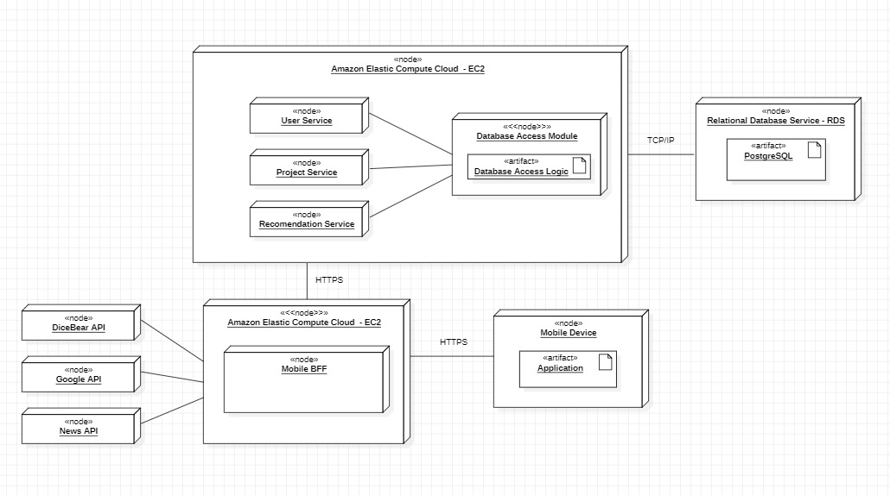

# Diagrama de Implantação

&emsp;&emsp;Um diagrama de implantação é uma representação gráfica usada em modelagem de software para especificar a configuração física dos artefatos, baseando nas unidades de software quanto nas unidades de hardware. Ele mostra como o software é distribuído literalmente em diferentes máquinas ou componentes de hardware e descreve as dependências físicas entre eles. Esses diagramas são úteis para visualizar, definir e documentar sistemas distribuídos, bem como para detalhar a infraestrutura necessária para o funcionamento do sistema.

  Figura 1 - Diagrama de Implantação
  
  Fonte: Os autores (2024)

&emsp;&emsp;O diagrama de implantação mostra a estrutura de um sistema distribuído usando a infraestrutura da Amazon Web Services (AWS). O sistema é dividido em dois grupos principais de nós hospedados no Amazon Elastic Compute Cloud (EC2). O primeiro grupo de nós EC2 contém três serviços: User Service, Project Service e Recommendation Service. Esses serviços se comunicam usando o protocolo TCP/IP com um nó do Relational Database Service (RDS) que hospeda um artefato PostgreSQL, indicando uma conexão de banco de dados.

&emsp;&emsp;Além dos serviços principais, este sistema também incorpora várias APIs externas como DiceBear API para geração de avatares, Google API para integrações variadas e News API para a aquisição de notícias atualizadas, todas comunicando-se através de HTTPS. Essas APIs estão estrategicamente posicionadas para oferecer funcionalidades complementares aos serviços principais, melhorando a experiência do usuário final e enriquecendo o aplicativo com dados externos relevantes.

&emsp;&emsp;O segundo grupo de nós EC2 contém um serviço chamado Mobile BFF (Backend For Frontend), que se comunica via HTTPS. Esta unidade está ligada a um dispositivo móvel, também comunicando-se via HTTPS, que executa uma aplicação. Isso indica uma arquitetura que separa as responsabilidades do backend, focando em servir um frontend em dispositivos móveis de maneira otimizada. Cada serviço no diagrama é referente a uma função específica, facilitando a escalabilidade e manutenção do sistema. Além disso, a comunicação segura via HTTPS entre o backend e os dispositivos móveis enfatiza a importância da segurança nas transações de dados.

&emsp;&emsp;O diagrama de implantação é essencial para o desenvolvimento do projeto, pois oferece uma visão clara da distribuição física dos componentes de software e de como eles interagem entre si em um ambiente de produção. Ele facilita a compreensão das dependências tecnológicas e da infraestrutura necessária, o que ajuda a prevenir problemas de integração e otimiza o uso dos recursos de hardware. Além disso, promove uma melhor colaboração entre a equipe de desenvolvimento, garantindo que todos estejam alinhados com a estrutura e os requisitos técnicos do sistema.