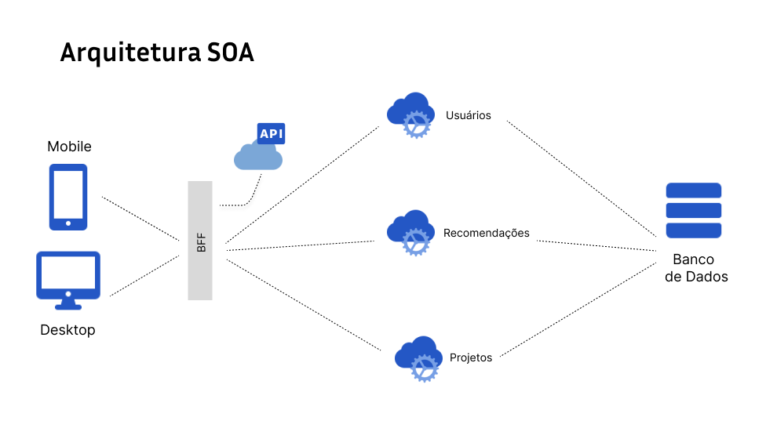

# Diagrama de Modelo de Arquitetura

&emsp;&emsp;O diagrama intitulado “Arquitetura SOA” representa uma arquitetura orientada a serviços, destacando a interação entre diferentes componentes de uma arquitetura de software. A seguir, é apresentada uma descrição detalhada dos elementos e suas relações conforme ilustrado no diagrama fornecido:

  Figura 1 - Diagrama de arquitetura
  
  Fonte: Os autores (2024)

# Usuários
&emsp;&emsp;No centro do diagrama, a entidade Usuários representa o ponto de partida para as interações dentro do sistema. Os usuários podem ser tanto internos quanto externos à organização e interagem com o sistema por meio de:

&emsp;&emsp;API: Interface de programação de aplicações que serve como ponto de entrada para os usuários acessarem os serviços disponíveis no sistema, seja através de dispositivos móveis ou desktops.
Recomendações: Funcionalidade que fornece sugestões personalizadas aos usuários com base em seus comportamentos e preferências anteriores.
&emsp;&emsp;Projetos: Módulo que permite aos usuários criar, gerenciar e monitorar projetos, incluindo suas interações e atualizações.

# Dispositivos
&emsp;&emsp;Os usuários acessam o sistema através de dispositivos Mobile e Desktop, que se conectam ao sistema por meio da API. Isso indica que a arquitetura suporta múltiplas plataformas, garantindo flexibilidade e acessibilidade.

# Banco de Dados
&emsp;&emsp;O Banco de Dados é um componente crucial que armazena informações sobre usuários, recomendações e detalhes do projeto. Ele está conectado ao sistema central, sugerindo que serve como armazenamento de back-end para todas as informações manipuladas pelo sistema.

# Conclusão
&emsp;&emsp;O diagrama de Arquitetura SOA é interessante por fornecer uma representação visual de como diferentes componentes em uma arquitetura orientada a serviços interagem entre si. Ele mostra como os usuários podem interagir com uma aplicação através de várias plataformas, como dispositivos móveis e desktops, por meio de uma API, como suas ações podem se relacionar com recomendações e projetos dentro do sistema e como todas essas informações são armazenadas em um banco de dados centralizado.
&emsp;&emsp;Este diagrama de Arquitetura SOA é uma representação simplificada, mas abrangente, da estrutura e das interações dentro de um sistema orientado a serviços. Ele destaca a importância de uma API unificada para acessar o sistema e a relevância de um banco de dados centralizado para armazenar informações críticas. Esses elementos são fundamentais para garantir que o sistema seja robusto, escalável e capaz de atender às necessidades dos usuários de maneira eficiente.

