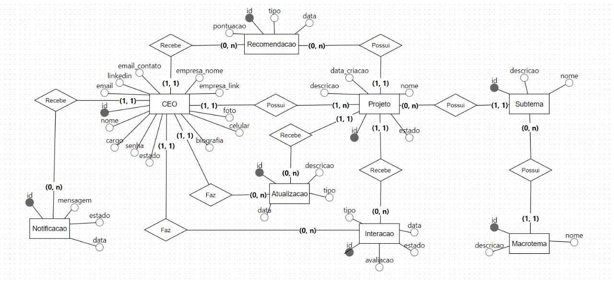

# Diagrama de Modelo Conceitual do Banco de Dados

&emsp;&emsp;Inicialmente, um modelo conceitual em um banco de dados relacional representa uma visão de alto nível da estrutura organizacional e dos relacionamentos entre as entidades e seus atributos. Esse modelo descreve os tipos de dados que serão armazenados e como eles se inter-relacionam, porém sem mergulhar nos detalhes técnicos de como esses dados serão efetivamente manipulados. Essa abordagem simplificada torna o modelo altamente acessível e compreensível, o que é essencial para assegurar uma compreensão clara e facilitar o desenvolvimento da solução.

  Figura 1 - Modelo Conceitual
  
  Fonte: Os autores (2024)

&emsp;&emsp;No modelo conceitual proposto, a entidade **CEO** ocupa uma posição central e interage com diversas outras entidades. Através de informações como `nome`, `email`, `senha`, `cargo`, entre outros, e relacionamentos como receber **Notificações**, **Recomendações**, **Projetos**, e **Atualizações**, o modelo detalha a organização e funcionamento das interações entre as entidades, atributos e relações de cardinalidade, permitindo assim que as funcionalidades relacionadas aos serviços sejam executadas da melhor maneira possível.

&emsp;&emsp;A entidade **Projeto**, diretamente vinculada ao CEO, ilustra como iniciativas específicas são estruturadas e monitoradas, com cada projeto podendo incluir **Macrotemas** e **Subtemas**, estando sujeito a **Interações** e **Atualizações** que documentam o progresso e o engajamento com os stakeholders. Essa inter-relação é fundamental para manter uma visão clara do estado e evolução dos projetos, facilitando o desenvolvimento e acompanhamento dos projetos em sinergia, tanto pelos CEOs, como também para a Fundação.

&emsp;&emsp;O uso de **Subtemas** e **Macrotremas** permite uma categorização eficiente dos projetos. Essa organização melhora significativamente a navegação e a apresentação de informações relevantes, sendo essencial para uma experiência de usuário otimizada em dispositivos móveis. Integrando essas entidades de maneira estruturada, o modelo conceitual facilita não apenas a compreensão da estrutura conceitual do sistema, mas também auxília em uma solução bem mais robusta e focada em colaborar para mais legados serem contruídos, o que é o objetivo principal dessa proposta da FDC.
