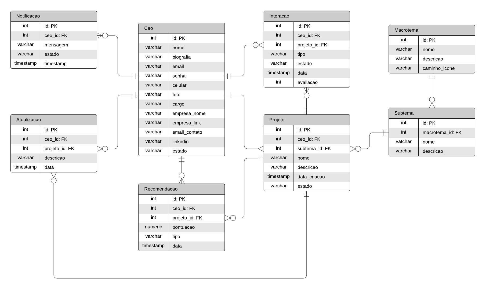

# Diagrama de Modelo Lógico

&emsp;&emsp;O Modelo Lógico, baseado no Modelo Conceitual, retrata o banco de dados de forma mais alinhada com a visão do sistema de gerenciamento de banco de dados. Nele, as entidades conceituais são transformadas em tabelas, cada uma com suas chaves primárias próprias. Essas tabelas têm relacionamentos entre si e podem conter chaves estrangeiras. Além disso, os tipos de dados são definidos para cada coluna, como inteiro, string, data, entre outros.

  Figura X - Modelo Lógico
   
  Fonte: Os autores (2024)

### Relação entre as tabelas

&emsp;&emsp;Dentro de um modelo lógico de banco de dados, a chave estrangeira (foreign key) desempenha um papel fundamental ao conectar diferentes tabelas. Essa chave é composta por uma coluna ou conjunto de colunas em uma tabela, estabelecendo uma relação referencial com uma chave primária ou única em outra tabela. Essa conexão é essencial para manter a integridade referencial dos dados compartilhados entre as tabelas.

| **Tabela**     | **Atributo(s)**                                  |
|------------------|--------------------------------------------------|
| Notificação  | __ceo_id:__ Identificador do CEO destinatário.|
| Atualização  | __ceo_id:__ Identificador do CEO que atualizou; __projeto_id:__ Identificador do projeto atualizado.|
| Recomendação | __ceo_id:__ Identificador do CEO destinatário; __projeto_id:__ Identificador do projeto recomendado.|
| Interação    | __ceo_id:__ Identificador do CEO que interagiu; __projeto_id:__ Identificador do projeto interagido.    |
| Projeto      | __ceo_id:__ Identificador do CEO criador do projeto; __subtema_id:__ Identificador do subtema do projeto.|
| Subtema      | __macrotema_id:__ Identificador do macrotema.       |